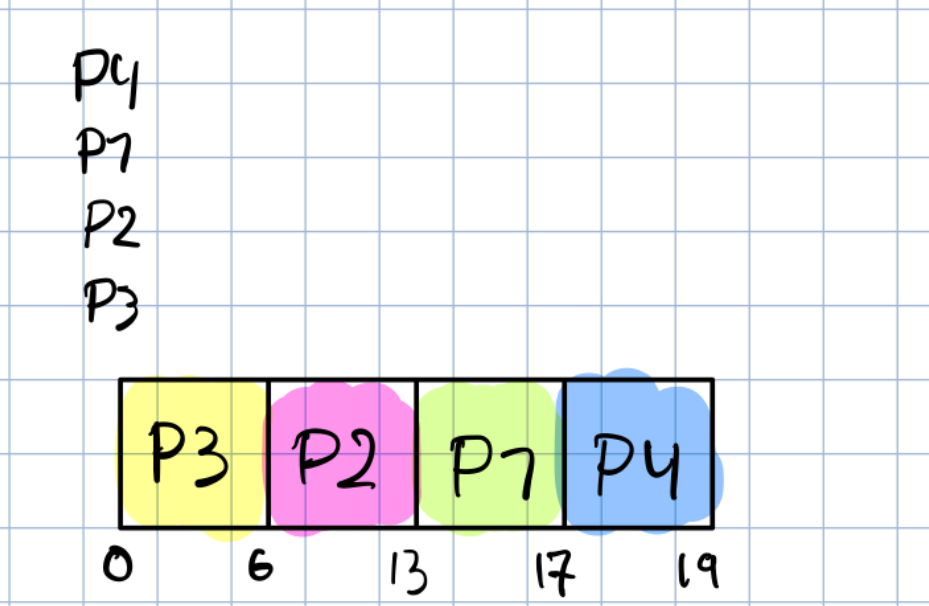
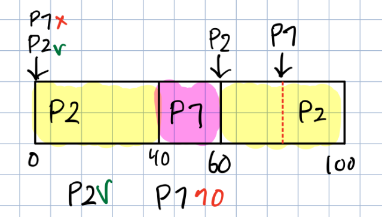
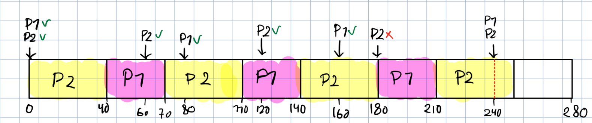

# Eksamen 2021 høst

Har latet som at mitt kandidatnummer er 2 (even)

## Oppgave 1 – Flervalgsoppgave

For hver av flervalgsoppgavene nedenfor, velg ikke mer enn et av alternativene

### 1.1

Hvilken av de følgende er **riktig**?

- [ ] **(a)** Programtelleren inneholder instruksjonen prosessoren utfører akkurat nå
- [ ] **(b)** Programtelleren inneholder adressen for instruksjonen prosessoren utfører akkurat nå
- [x] **(c)** Programtelleren er et register
- [ ] **(d)** Alle de ovennevnte
- [ ] **(e)** Ingen av de ovennevnte

### 1.2

Hvilken av det følgende er **feil** om "pipelining"?

- [x] **(a)** "Pipelining" tillater utførelse av flere instruksjoner på samme tid på en kjerne
- [ ] **(b)** Stadiene for en instruksjonssyklus i "pipeline" krever ulik tid for prosessering
- [ ] **(c)** Av og til er det ikke den instruksjonen som er hentet på forhånd (prefetched) som er den neste som blir utført
- [ ] **(d)** Alle de ovennevnte
- [ ] **(e)** Ingen av de ovennevnte

### 1.3

En sidefeil (page fault) hender når ...

- [ ] **(a)** En forespurt side (page) er i "backing store"
- [ ] **(b)** En forespurt side er funnet i translation look-aside buffer (TLB)
- [ ] **(c)** En forespurt side er i minnet
- [ ] **(d)** Alle de ovennevnte
- [x] **(e)** Ingen av de ovennevnte

### 1.4

Ta utgangspunkt i en prosessor som trenger `5 ns` for å få tilgang til cache-minne og `200 ns` for å få tilgang til hovedminnet.
Anta at cache-treffrate (cache hit ratio) er 95%, hva er da gjennomsnittlig tilgangstid for prosessoren?

- [ ] **(a)** 5 ns
- [ ] **(b)** 10 ns
- [x] **(c)** 15 ns
- [ ] **(d)** 20 ns
- [ ] **(e)** 100 ns
- [ ] **(f)** Ingen av de ovennevnte

### 1.5

Ta utganspunkt i instruksjonen `mov edx [hello]`.
Hvor mange operander har denne instruksjonen?

- [ ] **(a)** 3
- [x] **(b)** 2
- [ ] **(c)** 1
- [ ] **(d)** 0
- [ ] **(e)** Ingen av de ovennevnte

### 1.6

Ta utgangspunkt i en instruksjon med to operander O1, O2.
Hvis O1 bruker PC-relativ adresseringsmodus, O2 bruker indirekt adresseringsmodus,
hvor mange minnetilganger trengs i alt for å hente O1 og O2?

- [ ] **(a)** 4
- [x] **(b)** 3
- [ ] **(c)** 2
- [ ] **(d)** 1
- [ ] **(e)** 0
- [ ] **(f)** Ingen av de ovennevnte

### 1.7

La `ℓ` være en lås, og x en delt int variabel initialisert til 0.
Ta utgangspunkt i to prosesser `P1` og `P2` som samtidig kjører de følgende kodesekvensene:

```c
// Run by P1 //
x--;
```

```c
// Run by P2 //
acquire(ℓ);
x--;
release(ℓ);
```

Hvilken av de følgende er **feil**?

- [ ] **(a)** Verdien av x er −1 når `P1` og `P2` er ferdige
- [ ] **(b)** Verdien av x er −2 når `P1` og `P2` er ferdige
- [ ] **(c)** Det er en "race condition"
- [ ] **(d)** Alle de ovennevnte
- [x] **(e)** Ingen av de ovennevnte

### 1.8

Hvilken av de følgende er en funksjon for en "dispatcher"?

- [ ] **(a)** å kontekst-bytte prosesser
- [ ] **(b)** å gi kontroll over CPUen til prosessen valgt ut av korttids-planleggeren
- [ ] **(c)** å hoppe til riktig posisjon i bruker-programmet for å starte opp igjen det programmet
- [x] **(d)** Alle de ovennevnte
- [ ] **(e)** Ingen av de ovennevnte

### 1.9

Hvilken av de følgende er **feil**?

- [ ] **(a)** Sideinndeling (paging) tillater minnet allokert til en prosess å være usammanhengende
- [x] **(b)** Sideinndeling løser problemet med intern fragmentering
- [ ] **(c)** Sideinndeling løser problemet med ekstern fragmentering
- [ ] **(d)** Sideinndeling unngår problemet med thrashing
- [ ] **(e)** Alle de ovennevnte
- [ ] **(f)** Ingen av de ovennevnte

### 1.10

Hvilken av de følgende planleggingsalgoritmene har et utsultingsproblem?

- [ ] **(a)** Korteste jobb først
- [ ] **(b)** "Multilevel Queue Scheduling"
- [ ] **(c)** Korteste-tid-igjen-først
- [x] **(d)** Alle de ovennevnte
- [ ] **(e)** Ingen av de ovennevnte

### 1.11

Hvilken av de følgande er **riktig**?

- [ ] **(a)** PCBer blir egentlig ikke brukt av operativsystemet, men er bare vedlikeholdt for å kunne tilby brukeren statistikker om prosessene
- [ ] **(b)** PCBer er datastrukturene operativsystemet bruker for å implementere multi-programmering, kontekst-bytte, og også prosess-"forks"
- [ ] **(c)** En PCB inneholder ikke en programteller
- [ ] **(d)** En PCB inneholder en datamaskins tjenernavn
- [ ] **(e)** Alle de ovennevnte
- [x] **(f)** Ingen av de ovennevnte

### 1.12

Hvilken av de følgende er **feil**?

- [ ] **(a)** fork()-systemkallet er brukt for å opprette en ny prosess på en UNIX datamaskin
- [ ] **(b)** En ny barne-prosess som blir opprettet ved bruke fork()-systemkallet er i utgangspunktet identisk med foreldre-prosessen
- [ ] **(c)** En prosess kan bruke retur-verdien fra fork()-systemkallet for å avgjøre om den er foreldre eller barneprosessen
- [ ] **(d)** exec()-systemkallet kan brukes til å bytte ut programinnholdet for en barneprosess
- [ ] **(e)** Alle de ovennevnte
- [x] **(f)** Ingen av de ovennevnte

### 1.13

Hvilken av de følgende er **riktig**?

- [ ] **(a)** å opprette en ny prosess krever nesten ingen ressurser, og det er derfor ingen grunn til å ikke opprette prosesser
- [ ] **(b)** En prosess og en tråd er bare forskjellige navn på nøyaktig det samme
- [x] **(c)** En tråd blir også kallt en lett prosess
- [ ] **(d)** Det er bare mulig å opprette tråder på et multi-CPU/kjerne-system
- [ ] **(e)** Alle de ovennevnte
- [ ] **(f)** Ingen av de ovennevnte

### 1.14

Hvilken av de følgende er **feil**?

- [ ] **(a)** Et systemkall blir brukt av et brukerprogram for å be operativsystemet om å gjøre en handling for seg
- [ ] **(b)** Et systemkall kan gjøre en handling som brukerprogrammet ikke har tilgang til å gjøre selv
- [ ] **(c)** Som regel blir systemkall brukt ved hjelp av høy-nivå systembibliotek
- [ ] **(d)** Et systemkall blir også kallt et programvareavbrudd (software interrupt)
- [x] **(e)** Ingen av de ovennevnte

## Oppgave 2 – Diverse

### 2.1

La ℓ1 og ℓ2 være låser, og x en delt int variabel initialisert til 1.
Ta utgangspunkt i tre prosesser P1, P2 og P3 som samtidig kjører de følgende kodesekvensene:

```c
// Kjørt av P1 //
acquire(ℓ1);
x++;
release(ℓ1);
```

```c
// Kjørt av P2 //
acquire(ℓ2);
x--;
release(ℓ2);
```

```c
// Kjørt av P3 //
acquire(ℓ1);
x++;
release(ℓ1);
```

List opp alle mulige verdier som x kunne ha når alle tre prosessene er ferdige.

> 0, 1, 2, 3

### 2.2

Når en applikasjon har behov for å utføre flere oppgaver samtidig (i parallell),
så kan dette gjøres enten ved å starte flere prosesser eller tråder.
Hva er forskjellene mellom prosesser og tråder?
Gi eksempel på "typisk" bruk for begge.

> Tråder deler resurser med foredlreprosessen, mens en prosess gjør ikke det.
> Hvis en skal dele resurser mellom prosesser må en sette opp kommunikasjon mellom dem ved f.eks. en pipe.
> Hvis en tråd kræsjer, så vil foreldreprosessen også kræsje, men hvis en child-prosess kræsjer så vil ikke foredlreprosessen kræsje.
> Typisk bruk av tråder er f.eks. i en GUI applikasjon så ønker en at GUI-en skal være responsiv.
> Derfor bruker en flere tråder slik at GUI-en kjører i sin egen tråd, og alle funksjoner som applikasjonen skal utføre kjøres i en annen(andre) tråd(er).

### 2.3

Maskivarekomponenter som CPU, minne, I/O-kontroller, etc. kan kommunisere enten via en delt buss eller via en punkt-til-punkt–forbindelse.
Hva er forskjellene mellom disse to typene forbindelser, og hva er deres relative fordeler/ulemper for hver?
Punkt-til-punkt–forbindelser blir stadig mer populære.
Hvorfor er dette?

> Punkt-til-punkt–forbindelse binder sammen to enheter, mens en delt bus kobler mange enheter sammen.
> I en delt bus må det implementeres logikk for å forhindre at flere enheter prøver å bruke samme resurs samtidig, såkalte kollisjoner.
> Dette fører til en del overhead og kompleksitet, som kan gjøre det vanskelig å skalere.
> Hvis en punkt-til-punkt-forbindelse og en delt bus kjører i samme hastighet så vil punkt-til-punkt-forbindelsen være kjappere da den slipper alt overheaden.
> Derfor blir punkt-til-punkt-forbindelser mer og mer populært.

### 2.4

Hva er forskjellene mellom en CPU og en kjerne?
Er det noen mulige forskjeller med tanke på ytelse om to kjerner er fysisk plasserte i den samme brikken, eller om de er plasser i to ulike brikker?
Hvorfor og hvorfor ikke?

> En CPU er en komplett pakke som inneholder flere komponenter, ofte flere kjerner.
> En kjerne er den delen av CPU-en som utfører instruksjoner. Moderne kjerner har ofte flere ting innebygget i seg, som f.eks cache.
> I CPU pakken er det også ofte en del cache som alle kjernene deler, i tillegg til andre ting som en minnekontroller og I/O kontroller
> Noen CPU-er har også innebygget GPU.
>
> Det er definitivt forskjeller hvis kjerner er i samme CPU pakker eller seperate.
> Hver CPU-pakke har sin egen cache og minnekontroller, noe som kan føre til at et program som kjører på den ene CPU-en trenger data som er lagret i minnet koblet til den andre CPU-en, noe som fører til veldig mye overhead.

### 2.5

Tidlige datasystem hadde ikke mulighet til å lagre program (prosesseringsinstruksjoner) som "data".
I steden var de "hard-kodet" med ledninger.
Hvorfor er det viktig å være i stand til å lagre program som data?
Hva er konsekvensene om dette ikke er mulig?

> Dette var før en begrensing i design, før man fikk det som nå er generelle prosessorer.
> Nå som en kan lagre instruksjoner(programmer) som data så kan man ha generelle prosessorer som kan gjøre "alt"
> Før når man ikke hadde generelle prosessorer så var det veldig innviklet å endre på funksjonaliteten, en måtte fysisk flytte på ledninger etc. for å endre på programmet som skal kjøres. Nå trenger en bare endre på noe kode.
> Dette fører til at utvikling tar vesentlig mye midre tid, og det gjør også datasystemer mye mer nyttig til hverdagsbruk.
> Hadde vi ikke fått til å lage generelle prosessorer og mulighet for å lagre programmer som data, så hadde nok verden lignet mer på 60-tallet enn sli kden er nå.
> Dette betyr ikke at "hard kodede" datasystemer er dårlige og forsvant.
> I moderne tid kaller vi slike "hard kodede" datasystem for en ASIC, Application Specific Integrated Circuit.
> Det betyr at den er spesiallaget for å gjøre **en** spesifikk oppgave, og kan ikke gjøre andre ting.
> En ASIC vil være **MYE** bedre til å utføre oppgaven den er designet for enn en generell prosessor.
> En typisk situasjon hvor en bruker ASIC er i industrielle maskiner og systemer.
> Der ønsker man best mulig ytelse, best mulig stabilitet og minst mulig strømtrekk, og det er typisk for en ASIC å være bedre enn en generell prosessor på alle de måtene.
>
> Et eksempel på en ASIC som mange bruker i hverdagen er en GPU, eller grafikkort.
> Før så ble alt av grafikk rendering gjort på CPU-en. Dette førte til limitasjoner i hvor raskt og avansert en kunne ha f.eks 3D grafikk i spill.
> Etterhvert fikk vi GPU-er som var spesialdesignet for å utføre den typen mattematikk som må til for å vise avansert 3D grafikk, og vi gikk ifra enkle 2d sidescroller spill med enkle bilder til de hyperrealistiske 3D spillene vi har idag.

## Oppgave 3 – Sideinndeling

Ta utgangspunkt i at 1 KB er 1024 byter, og anta at sidestørrelsen er
***`Even`*** kandidatnummer: 4 KB
***`Odd`*** kandidatnummer: 8 KB

### 3.1

Skriv ned, med desimaltall, sidenummeret og "offset" for adressen 32543.

> Bruker integer divisjon for å finne sidetall, og modulo for å finne offset

```math
sidenummer = 32543 / 4096 = 7 \\

offset = 32543 \mod 4096 = 3871
```

### 3.2

Ta utgangspunkt i et datasystem som bruker 64-biter logisk adresse og har fysisk minne som er delt inn i F rammer.

- **(a)**
	Hva er det logiske adresserommet?

	> 2^64 = 18446744073709600000

- **(b)**
	Hva er størrelsen på hver ramme i det fysiske minnet?

	> 4096 B = 4 KB
	>> Rammestørrelse og sidestørrelse vil alltid være lik

- **(c)**
	Om systemet har en invertert sidetabell, hvor mange plasser har tabellen?

	> F

> ***Copilot*** forklaring
>> En invertert sidetabell er en datastruktur som operativsystemet bruker for å holde styr på hvilke sider av en prosess som er lastet inn i hvilke rammer i det fysiske minnet.
>> I en invertert sidetabell, er det en oppføring for hver ramme i det fysiske minnet, ikke for hver side i det logiske minnet.
>>
>> Så, hvis systemet har F rammer, vil den inverterte sidetabellen ha F plasser.
>> Dette er fordi hver ramme i det fysiske minnet vil ha en tilsvarende oppføring i den inverterte sidetabellen.

## Oppgave 4 – CPU-planlegging

### 4.1

Generelt vil en prosess i et system være i en av disse fem tilstandene:
ny, klar, kjørende, ventende, avsluttet.
En tilstandstransisjon for en prosess betyr at en prosess går fra en tilstand til en annen,
f.eks., en tilstandstransisjon klar → kjørende betyr at en prosess går fra klar-tilstand til kjørende-tilstand.
Skriv ned tilstandstransisjon(ene) hvor planleggingsavgjørelse (scheduling decision) vil skje om
operativsystemet bruker avbrytbar (preemptive) planleggingsalgoritme?

> ny → klar
> ventende → klar
> kjørende → klar
> kjørende → ventende
> kjørende → avsluttet

### 4.2

Ta utgangspunkt i følgende tabell for utbruddstid (burst time) for prosessene P1, P2, P3 og P4 som kommer på tid = 0:

| Prosess | Utbruddstid |
| :---: | :---: |
| P1 | 4 |
| P2 | 7 |
| P3 | 6 |
| P4 | 2 |

Anta at rekkefølgen de kommer er
***`Even`*** kandidatnummer: P3, P2, P1, P4
***`Odd`*** kandidatnummer: P4, P1, P3, P2

Om "First Come First Served" planleggingsalgoritme blir brukt, hva er den gjennomsnittlige behandlingstiden (turnaround time)?
Bruk et Gantt-diagram for å rettferdiggjøre svaret ditt.

> 6 + (6 + 7) + (4 + 6 + 7) + (2 + 4 + 6 + 7) = 55
> 55 / 4 = 13.75
> 

### 4.3

Ta utgangspunkt den følgende tabellen for prosesseringstid og periode for to periodiske prosesser P1 og P2:

| Proeess | Prosesseringstid | Periode |
| :---: | :---: | :---: |
| P1 | 30 | 80 |
| P2 | 40 | 60 |

Fristen for fullførelse av hver prosess er begynnelsen av prosessen sin neste periode.
For eksempel, fristen for fullførelse av P1 er på tidene 80, 160, 240, ...,
mens fristen for fullførelse av P2 er på tidene 60, 120, 180, 240, ... .
Anta at planlegging bare blir utført når en prosess kommer eller blir avsluttet.

- **(a)**
	Anta at P2 har høyere prioritet enn P1.
	Bruk Rate-monotonic Scheduling for å planlegge de to prosessene.
	Ved tid = 280, kan de to prosessene tilfredsstille alle sine frister?

	> nei
	> 

- **(b)**
	Bruk Tidligste tidsfrist først for å planlegge de to prosessene.
	Ved tid = 280, kan de to prosessene tilfredsstille alle sine frister?

	> nei
	> 

Tegn et Gantt-diagram for utførelsene av hver av planleggingsalgoritmene for å rettferdiggjøre svaret ditt.
Tidslinjen for hvert av Gantt-diagrammene skal holde frem til tid = 280,
eller til tidspunktet hvor en prosess ikke kan tilfredsstille sin frist, dvs.,
om en prosess ikke kan tilfredsstille sin frist ved tid = 150,
da skal tidslinjen for Gantt-diagrammet være frem til 150.

## Oppgave 5 – Minnetilgangstid

### 5.1

Ta utgangspunkt i en side-maskinvare (paging hardware) med et translation look-aside buffer (TLB).
Anta at sidetabellen og alle sidene til en prosess-forespørsel er i det fysiske minnet.
Anta at prosent-andelen av gangene som et sidenummer av interesse er funnet i TLB1 er 85%,
hvert TLB-oppslag tar 1 ns, og hver minnetilgang tar 200 ns.
Hva er den effektive tilgangstiden (EAT)?

> 0.85 \* (1 + 200) + 0.15 \* (1 + 200 + 200) = 231 ns

### 5.2

Ta utgangspunkt i en prosess som har sin side-tabell og noen av sine forespurte sider i fysisk minne.
Anta at prosessen forsøker å få tilgang til en side hvor sidenummeret ikke er funnet i TLB, og en sidefeil (page fault) hender.
Hvor mange "page transfers", dvs., å flytte sider inn i (eller ut av) "backing store", er nødvendig for å hente denne siden dersom

- **(a)**
	det er ubrukte rammer hovedminnet?

	> 1

- **(b)**
	det er ikke ubrukte rammer, men alle rammene er rene?

	> 1

## Oppgave 6 – Cache

### 6.1

Ta utgangspunkt i B0, B2, B4, B6 og B8 er mappet til C0, og B1, B3, B5, B7 og B9 er mappet til C1.
Anta at de følgende er i cachen:

***`Even`*** kandidatnummer: B3 og B8
***`Odd`*** kandidatnummer: B2 og B9

hvor Bi refererer til den i-ende blokken i hovedminnet og Cj refererer til den j-ende cachelinjen.
Hva er antallet cache-feil (cache misses) om B5, B2, B8, B9, B8 blir aksessert i den viste rekkefølgen?
Grunngi svaret ditt ved å identifisere hvilke aksesser som førte til cache-feil.

> i cache: B3 B8
> B5 → miss, B5 erstatter B3
> B2 → miss, B2 erstatter B8
> B8 → miss, B8 erstatter B2
> B9 → miss, B9 erstatter B5
> B8 → hit
>
> Det blir 4 cache miss

### 6.2

En enkelt-trådet applikasjon har behov for å prosessere en større mengde data.
Dataene består av verdier som skal prosesseres i flere prosesserings-operasjoner (steg), på samme måte, og uavhengig av andre data-verdier.
Dette betyr at prosesseringen kan bli utført på to måter (tilnærminger):

- Samme operasjon først: først utfør samme (enkle) operasjon på alle vardier, så gå videre til den neste (enkle) operasjonen.
- Samme verdi først: først utfør alle operasjoner på den samme (enkle) verdien, så gå vidare til den neste (enkle) verdien.

(Instruksjoner som kan fungere på vektorer av verdier er ikke tilgjengelig.)
For å avgjøre hvilken tilnærming som er mest effektiv, har begge tilnærmingene blitt implementert og testet.
Testene viser at den siste metoden er raskeste.
Basert på dine kunnskapar om CPU cacher, forklar hvordan dette kan skje.

> Ved den første metoden så vil det oppstå mange cache miss da den må konstant hente nye verdier fra minnet.
> Hvis man da gjør alle operasjonene på samme tall med en gang vil en få færre cache miss, og ytelsen til programmete øker

### 6.3

Underveis på testene nevnt ovenfor, blir det også lagt merke til en betydelig økelse i hastigheten på en CPU som har dobbelt så mye L1 cache som en annen ellers identisk CPU.
Hva er mulige grunner for dette?
Er det noe du kan forsøke for å også forbedre ytelsen for applikasjonen på CPUen med mindre L1 cache (uten å endre maskinvaren)?

> Grunnen til dette er fordi mer cache lar deg holde mer av dataen du jobber med i cache, og dermed også få færre cache miss
>

### 6.4

Mellom CPUen og hovedminnet (RAM), er det som regel tre lag (L1, L2, L3) med cache minne.
Dette minnet er minkende raskt og økende stort.
Forklar grunnene for dette, og hvordan disse lagene samhandler.
Hvorfor er det så "komplisert" — hvorfor ikke bare et enkelt lag med cache?

> Raskere cache tar mer fysisk plass på "die"-en
> Grunnen til å ha flere lag er for å minske nedsidene med å velge kun en type. De forskjellige lagene L1 L2 L3 har foskjellige hastigheter og minne tetthet (hvor mye minne per fysisk størrelse)
>

## Oppgave 7 – Prosess-synkronisering

### 7.1

En mediaavspiller-applikasjon har to tråder.
Den ene (nedlasteren) tråden vil laste ned media fra
en nett-tjener, og plassere det på et lokalt buffer med 10 plasser.
Den andre (dekoderen) tråden vil lese data fra dette bufferet og dekode det.
Tabellen buffer er plassert på delt minne for å utveksle
data, og en normal variabel bufferStatus, også i delt minne, blir brukt for å indikere statusen for dette bufferet.
Det er initialisert til 0.

```c
// Kode brukt av nedlasteren //
writePos = 0;
while(true){
	while(bufferStatus < 10){
		DownloadToBuffer(buffer[writePos]);
		writePos++;
		writePos=writePos % 10;
		bufferStatus++;
	}
}
```

```c
// Kode brukt av dekoderen //
readPos = 0;
while(true){
	while(bufferStatus > 0){
		DecodeFromBuffer(buffer[readPos]);
		readPos++;
		readPos=readPos % 10;
		bufferStatus--;
	}
}
```

Det meste av tiden fungerer denne mediaavspilleren greit.
Men, i skjeldne tilfeller krasjer den med en feilmelding som indikerer at en av trådene forsøker å få tilgang til feil plass i buffer-tabellen.
Basert på dine kunnskaper om prosess-synkronisering, forklar hvordan dette kan skje.

> Det kan oppstå en race condition på bufferStatus

### 7.2

Modifiser koden i Listings 1 og 2 ovenfor slik at den bruker semaforar for å synkronisere trådene.
Løsningen skal tilfredsstille alle krav til "mutual exclusion", fremgang og "bounded waiting".

```c
wait(int *semaphore){
	while (*semaphore <= 0){}; // "busy waiting" //
	*semaphore--;
}

signal(int *semaphore){
	*semaphore++;
}
```

>

### 7.3

Den opprinnelige løsningen i Listings 1 og 2 bruker "busy waiting".
Hva er ulempene med dette?
Hvorfor er det av og til fortsatt den bedre løsningen?
Forklar en fremgangsmåte for å unngå "busy waiting".

> busy waiting betyr at den blokkerer tråden

### 7.4

Ta utgangspunkt i følgende fremgangsmåte brukt av to prosesser for å synkronisere tilgang til delte data:

```c
// Kode brukt av P1 //
while(p!=1){}; // "busy waiting" //
// kritisk seksjon //
p=2;
// ikke-kritisk seksjon //
```

```c
// Kode brukt av P2 //
while(p!=2){}; // "Busy waiting" //
// kritisk seksjon //
p=1;
// ikke-kritisk seksjon //
```

- **(a)**
	Garanterer denne fremgangsmåten fremgang (progress) (ja/nei)?

	> nei

- **(b)**
	Garanterer denne fremgangsmåten gjensidig eksklusivitet (mutual exclusion) (ja/nei)?

	> ja
