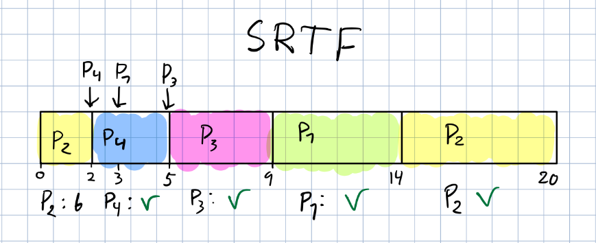
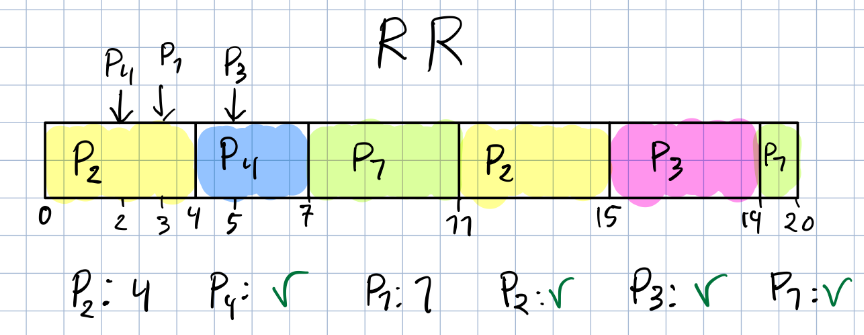
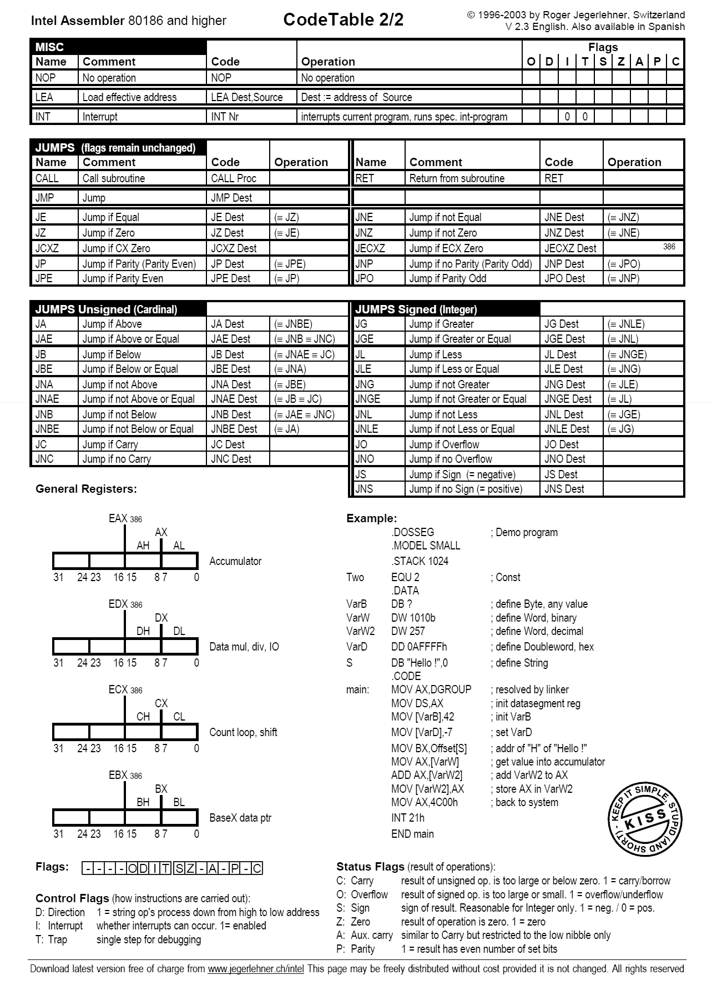

# Eksamen 2022 høst

## Oppgave 1 – Flervalgsoppgave

For hver av flervalgsoppgavene nedenfor, velg ikke mer enn ett av alernativene.

### 1.1

Hvem av de følgende er et kontroll- og statusregister?

- [ ] **(a)** Minneadresseregister
- [ ] **(b)** Instruksjonsregister
- [ ] **(c)** Minnebufferregister
- [x] **(d)** Alle de ovennevnte
- [ ] **(e)** Ingen av de ovennevnte

### 1.2

Hvem av de følgende utsagnene er feil?

- [ ] **(a)** Multiprogrammering er mulig i et enkelt-prosessorsystem
- [ ] **(b)** Multiprogrammering er mulig i ei multiprosessorsystem
- [x] **(c)** Multiprosessering er mulig i ei enkelt-prosessorsystem
- [ ] **(d)** Multiprosessering er mulig i ei multiprosessorsystem
- [ ] **(e)** Alle de ovennevnte
- [ ] **(f)** Ingen av de ovennevnte

### 1.3

Hvem av de følgende tidsplanlegging-algoritmene er generelt optimal for minimerende gjenomsnittlig ventetid?

- [ ] **(a)** "Round robin"
- [ ] **(b)** Først kommet først håndtert
- [x] **(c)** Korteste jobb først
- [ ] **(d)** Alle de ovennevnte
- [ ] **(e)** Ingen av de ovennevntee

### 1.4

Hvem av de følgende tidsplanlegging-agoritmene er ikke-avbruddbare?

- [ ] **(a)** "Round robin"
- [x] **(b)** Først kommet først håndtert
- [ ] **(c)** Første frist først
- [ ] **(d)** Korteste-tid-igjen-først
- [ ] **(e)** Ingen av de ovennevnte

### 1.5

En sidefeil hender når . . .

- [ ] **(a)** Ei TLB miss hender
- [ ] **(b)** Et avbrudd hender
- [ ] **(c)** Den forespurte siden er funnet i hovedminnet og er skitten
- [ ] **(d)** Den forespurte siden er funnet i hovedminnet og er rein
- [x] **(e)** Ingen av de ovennevnte

### 1.6

Ta utgangspunkt i et multiprosessorsystem som bruker symmetrisk multiprosessering (SMP).
Hvem av de følgande er riktig om multiprosessor tidsplanlegging for dette systemet?

- [ ] **(a)** Hver prosessor i dette systemet er selv-tidsplanleggande
- [ ] **(b)** Hver prosessor i dette systemet kan ha sin egen private kø av klare prosesser,
	og har en tidsplanlegger til å undersøke klar-køen og velge en prosess til å utføre
- [ ] **(c)** Alle prosessorene kan være i en felles klar-kø,
	og hver prosessor har en tidsplanlegger for å undersøke klar-køen og velge en prosess til å utføre
- [x] **(d)** Alle de ovennevnte
- [ ] **(e)** Ingen av de ovennevnte

### 1.7

Ta utgangspunkt i et datasystem som støtter logisk "cache". Hvem av de følgende er riktig?

- [ ] **(a)** Den logiske "cache" er lokalisert mellom minne- håndteringenhet (MMU) og hovedminne
- [ ] **(b)** Den logiske "cache" lagrer data ved å bruke hovedminne fysisk adresse
- [x] **(c)** Prosessoren har direkte tilgang til den logiske "cache"
- [ ] **(d)** Alle de ovennevnte
- [ ] **(e)** Ingen av de ovennevnte

### 1.8

Ta utgangspunkt i to prosesser, en for en nettleser, og en for en tekstbehandler, som konkurerrer for CPU tid.
Hvilken tidsplanlegger vil typisk være ansvarlig for å tidsplanlegge de to prosessene til CPUen??

- [ ] **(a)** Langtids-tidsplanleggeren
- [ ] **(b)** Mellomtids-tidsplanleggeren
- [x] **(c)** Korttids-tidsplanleggeren
- [ ] **(d)** Avhenger av operativsystemet

### 1.9

Hva er den mest vanlige måten å bruke operativsystemfunksjoner fra et brukerprogram?

- [ ] **(a)** Direkte via systemkall
- [x] **(b)** Indirekte via systembibliotek
- [ ] **(c)** Implementere det fra bunnen uten å involvere operativsystemet
- [ ] **(d)** Brukerprogram trenger typisk ikke operativsystemfunksjoner

### 1.10

Du har utviklet noe programvare i C for Linux datamaskin baserte på x86.
Hvilke andre platformer vil det vere "enkelt" å porte denne til?

- [ ] **(a)** Enhver datamaskin baserte på x86
- [x] **(b)** Ethvert operativsystem baserte på POSIX
- [ ] **(c)** Enhver datamaskin baserte på x86 som bruker ethvert operativsystem baserte på POSIX
- [ ] **(d)** Enhver datamaskin som bruker ethvert operativsystem

### 1.11

Hva betyr "programmering i maskinvare"?

- [ ] **(a)** Gammelt ord for å laste programmet fra en fil
- [ ] **(b)** Programmet er lagret på en harddisk
- [ ] **(c)** Programmet er lagret på et hullkort
- [x] **(d)** Programmet er i form av maskinvare

### 1.12

Hva er den "moderne" måten å overføre data inni en datamaskin?

- [ ] **(a)** Parallell buss punkt-til-punkt med pakker
- [x] **(b)** Seriell punkt-til-punkt forbindelse med pakker
- [ ] **(c)** Parallell buss punkt-til-punkt uten pakker
- [ ] **(d)** Seriell punkt-til-punkt forbindelse uten pakker
- [ ] **(e)** Ingen av de ovenfor

## Oppgave 2 – Diverse

### 2.1

Du utvikler en programvare som trenger å komprimere mye data i bakgrunnen mens brukeren samhandler med et GUI.
Dette kan gjøres ved å starte enten en ny tråd eller en ny prosess for å håndtere denne oppgaven.
Hva er forskjellene på å la enten en tråd eller en prosess håndtere dette?

> En egen prosess vil kreve mer resurser, i tillegg til at det må lages kommunikasjon mellom forelder prosess og den nye prosessen.
> En tråd har tilgang til samme minnet som forelder tråden som fører til mindre overhead.

### 2.2

I problemet ovenfor virkar det som at koden for å komprimere data har et problem som gjør at den til tider krasjer.
Vil dette påvirke avgjørelsen din om å bruke en tråd eller en prosess for å håndtere denne oppgaven?
Forklar svaret ditt.

> Om en tråd kræsjer så vil den ta med seg forelder tråden, og "hele" programmet kræsjer.
> Hvis vi bruker en seperat prosess så vil kun den prosessen kræsje, og resten av programvaren vil fremdeles kjøre.
> I utgangspunktet ville jeg sagt at dette ikke ville ha påvirket svaret, da løsningen på det nye problemstillingen er å finne årsaken og fikse grunnen til at komprimerings koden kræsjer.
> Hvis det ikke er mulig å fikse den av en eller annen grunn, så ville jeg da valgt å kjøre koden i en seperat prosess.

### 2.3

Anta at 10 multitrådede program kjører samtidig på et datasystem med 16 kjerner.
Anta videre at de fleirtrådede programmene er skrevet slik at de bruker mange-til-en trådmodell, og totalt har 100 brukertråder.
Hva er maksimum antall kjerner som vil bli brukt til å kjøre de 10 programmene?

> 10

### 2.4

Hvem av de følgende kan være del av en CPU?

- [x] (a) Programteller
- [ ] (b) I/O kontroller
- [ ] (c) Direkte minnetilgang (DMA)
- [x] (d) L1 "cache"
- [ ] (e) Haug
- [x] (f) Stabelpeker

### 2.5

La `l1`, `l2` og `l3` være låser, og x en delt int variabel initialisert til 10.
Anta tre prosesser `P1`, `P2` og `P3` som samtidig kjører de følgende kodedelene:

```java
// Kjørt av P1
acquire(l1);
x++;
release(l1);
```

```java
// Kjørt av P2
acquire(l3);
x++;
release(l3);
```

```java
// Kjørt av P3
acquire(l3);
x++;
release(l3);
```

List alle mulige verdier som `x` kunne ha når alle tre prosessene har avsluttet.

> Ved å bruke 3 forskjellige låser vil de ikke ha noen betydning for koden som kjøres.
> x kan da ha verdien 11, 12 eller 13, ut ifra når og hvilken rekkefølge hver prosess leser / skriver til minnet.

## Oppgave 3 – Sideinndeling

### 3.1

Ta utganspunkt i følgende tabell:

| Sidenummer | Rammenummer | Ramme sin startadresse |
| :---: | :---: | :---: |
| ***`i`*** | ***`j`*** | ***`k`*** |
| 0 | 12 | 49152 |
| 1 | 3 | 12288 |
| 2 | 7 | 28672 |
| 3 | 10 | 40960 |
| 4 | 2 | 8192 |
| 5 | 1 | 4096 |
| 6 | 0 | 0 |
| 7 | 9 | 36864 |

Hver linje `i` tabellen representerer en tilordning fra side `i` til ramme `j`, hvor ramme `j` starter fra adresse `k` i det fysiske minnet.
For eksempel, den første linjen referer til side 0 er tilordnet til ramme `12` som starter fra adresse `49152` i det fysiske minnet.
Anta at sidestørrelse er 4 KB (1 KB = 1024 Bytes).
Skriv ned, i desimal, sidenummeret, "offset" og den fysiske adressen for de logiske adressene:

- **(a)**
	`20515`

	> Bruker heltallsdivisjon for å finne sidenummer, og modulo for å finne offset.

	```math
	sidenummer = 20515 / 4096 = 5 \\
	offset = 20515 \mod 4096 = 35 \\
	fysiskadresse = 4096 + 35 = 4131
	```

- **(b)**
	`3812`

	```math
	sidenummer = 3812 / 4096 = 0 \\
	offset = 3812 \mod 4096 = 3812 \\
	fysiskadresse = 49152 + 3812 = 52964
	```

### 3.2

Ta utgangspunkt i et datasystem med et logisk adresserom på 65536 sider, som er tilordnet et fysisk minne på 2048 sider.
Anta at sidestørrelsen er 2 KB.

- **(a)**
	Hva er størrelsen for en ramme?

	> 2 KB

- **(b)**
	Hvor mange biter må en logisk adresse minst ha?

	> 65536 sider betyr at sidetabellen må ha like mange linjer

	```math
	65536 = 2^{16}\\

	linjer = 2^{bits} / sidestørrelse\\
	2048 * 65536 = 2^{11} * 2^{16} = 2^{27}
	```

	> En logisk adresse må ha minst 27 bits

- **(c)**
	Anta videre at hver tabellinje er 32 biter lang.
	Hva er maksimum størrelse for det fysiske minnet systemet kan adressere?

	```math
	2^{32} * 2^{11} = 2^{43} = 8796093022208 = 8 TB
	```

## Oppgave 4 – Assembler og adresseringmoduse

### 4.1

Ta utgangspunkt i kodefragmentet i assembler i listing 1.

```assembly
push dword 4
push dword 3
push dword 2
mov eax ,[esp +4]
mov ebx ,[esp +8]
mov ecx ,[esp]
add eax , ebx
```

Anta at alle instruksjonene i listing 1 har blitt utført, og stabelen vokser mot lavere adresser.

- **(a)**
	Hva er verdien ved adressen lagret i `esp`?

	> 2

- **(b)**
	Hva er verdien ved adressen lagret i `esp+8`?

	> 4

- **(c)**
	Har register `eax` nå en 32-biter esp+12.
	Om ikke, hvilken verdi har den nå?

	> Nei, 7

- **(d)**
	Har register `ebx` nå en 32-biter esp+8?
	Om ikke, hvilken verdi har den nå?

	> Nei, 4

- **(e)**
	Har register `ecx` nå en 32-biter esp?
	Om ikke, kvilken verdi har den nå?

	> Nei, 2

### 4.2

Anta at hver instruksjon nedenfor har allerede blitt hentet fra hovedminnet og plassert i et av registerene.
Hva er det totale antall minnetilganger som er nødvendig for å hente operandene for hver av instuksjonene?

- **(a)**
	`add eax, ebx`

	> 0

- **(b)**
	`mov ebx, [esp]`

	> 1

- **(c)**
	`mov [esp + 12], eax`

	> 0

## Oppgave 5 – CPU tidsplanlegging

### 5.1

Ta utgangspunkt i den følgende tabellen for "burst"-tid og ankomsttid for fire prosesser `P1`, `P2`, `P3` og `P4`:

| Prosess | "Burst"-tid | Ankomsttid |
| :---: | :---: | :---: |
| `P1` | 5 | 3 |
| `P2` | 8 | 0 |
| `P3` | 4 | 5 |
| `P4` | 3 | 2 |

Bruk gantt diagram for å forklare svarene dine for det følgende:

- **(a)**
	Anta at korteste-tid-igjen-først tidsplanlegging-algoritme blir brukt, og at tidsplanlegging blir utført bare ved ankomst eller fullførelse av prosesser.
	Hva blir rekkefølgen for fullførelse av de fire prosessene?

	> 
	> P4 → P3 → P1 → P2

- **(b)**
	Anta at "round robin" tidsplanlegging-algoritme med tidskvantum 4 blir brukt.
	Hva blir rekkefølgen for fullførelse av de fire prosessene?

	> 
	> P4 → P2 → P3 → P1

- **(c)**
	Hvilken tidsplanlegging-algoritme gir en lavere gjennomsnittlig ventetid av de fire prosessene, korteste-tid-igjen-først eller "round robin"?
	Rettferdiggjør svaret ditt ved å vise utregningene for den gjennomsnittlige ventetiden for hver tidsplanlegging-algoritme.

	> korteste-tid-igjen-først:
	>> P1: 6
	>> P2: 12
	>> P3: 0
	>> P4: 0
	>> gjennomsnitt: (6 + 12 + 0 + 0) / 4 = 18 / 4 = 4.5
	>
	> round robin:
	>> P1: 4 + 8 = 12
	>> P2: 7
	>> P3: 10
	>> P4: 2
	>> gjennomsnitt: (12 + 7 + 10 + 2) / 4 = 31 / 4 = 7.75

## Oppgave 6 – Minnetilgangtid

### 6.1

Ta utgangspunkt i et datasystem som ikke støtter sideinndeling,
og anta at prossesoren i systemet trenger `5 ns` for tilgang til "cache"-minne og `50 ns` for tilgang til hovedminnet.
Anta at treffratioen for "cache" er 95%, og at hvert "cache"-oppslag tar ingen tid.
Hva er den gjennomsnittlige minnetilgangtid for prosessoren?

```math
(0.95 * 5) + (0.05 * (50 + 5)) = 7.5ns
```

> **Copilot** forklaring
> gjennomsnittlig minnetilgangstid = treffratio for cache \* tilgangstid for cache + (1 - treffratio for cache) \* (tilgangstid for cache + tilgangstid for hovedminne)
> I dette tilfellet er treffratio for cache 95% eller 0.95, tilgangstid for cache er 5 ns og tilgangstid for hovedminne er 50 ns.
> Så vi får:
> gjennomsnittlig_minnetilgangstid = 0.95 \* 5 + 0.05 \* (5 + 50) = 7.5 ns

### 6.2

Nå ta utgangspunkt i et datasystem som støtter sideinndeling og har en sideinndelingmaskinvare med oversettelse "look-aside" buffer (TLB).
Anta at sidetabellen og alle sidene en prosess trenger er i det fysiske minnet.
Anta at prosentandelen av ganger som sidenummeret av interesse er funnet i TLB 2 er `90%`,
hvert TLB oppslag tar ingen tid, og minnetilgangtid for hver tilgang er `100 ns`.

- **(a)**
	Hva er effektiv tilgangtid (EAT)?

	```math
	(0.9 * 100) + (0.1 * (2 * 100)) = 110ns
	```

	> **Copilot** forklaring
	> EAT = treffratio for TLB \* minnetilgangstid + (1 - treffratio for TLB) \* (minnetilgangstid for TLB miss)
	> I dette tilfellet er treffratio for TLB 90% eller 0.9, minnetilgangstid er 100 ns og minnetilgangstid for TLB miss er 2 * minnetilgangstid (fordi vi må tilgang minnet to ganger, en gang for å hente sidetabellen og en gang for å hente data).
	> Så vi får:
	> EAT = 0.9 \* 100 + 0.1 \* (2 \* 100) = 110 ns

- **(b)**
	Nå anta at to-nivå sideinndeling-algoritme blir brukt for å stukturere sidetabellen, og det er en TLB miss når prosessen spør etter en side.
	Hvor mange minnetilganger er nødvendig for å hente denne siden?

	> 3
	>
	>> **Copilot** forklaring
	>> Hvis det er en TLB miss når prosessen spør etter en side og to-nivå sideinndeling-algoritme blir brukt for å strukturere sidetabellen, vil det være nødvendig med 3 minnetilganger for å hente denne siden.
	>> Dette er fordi vi må tilgang minnet en gang for å hente det første nivået av sidetabellen, en gang for å hente det andre nivået, og en gang for å hente data.

## Oppgave 7 – Cache

### 7.1

Ta utgangspunkt i at `B0`, `B2`, `B4`, `B6` and `B8` er tilordna til `C0`,
og `B1`, `B3`, `B5`, `B7` and `B9` er tilordnet til `C1`,
hvor `Bi` refererer til `i` blokk i hovedminnet og `Cj` refererer til `j` "cache"-linje.
Anta at `B3` og `B8` er i "cache".
Hva er antall "cache" miss om `B8`, `B2`, `B8`, `B9`, `B8` har tilgang i den viste rekkefølgen?
Rettferdiggjør svaret ditt ved å vise hvilke tilganger som førte til "cache" miss.

> cache: B3, B8
> B8 → hit
> B2 → miss, B2 erstatter B8
> B8 → miss, B8 ersattter B2
> B9 → miss, B9 erstatter B1
> B8 → hit
>
> Ble totalt 3 cache miss

### 7.2

Som programmerer kan du utnytte CPU-register ved å referere til deres navn,
og du kan utnytte hovedminnet ved å referere til dens adresser.
Men hvordan utnytter du "cache"?
Grunngi svaret ditt.

> I motsetning til CPU-registre og minne, så kan en ikke direkte påvirke hva som lagres i cache.
> Cache håndteres av hardware i CPU-en som automatisk henter og lagrer data etter visse algortimer.
> Det man kan gjøre er å skrive kode som utfører oppgaver på en viss måte slik at færre cache-miss oppstår.
> Moderne CPU-er har flere måter å optimere cache bruk, som f.eks. å hente relatert data samtidig og prefetching.
> Prefetching betyr at cache kontrolleren prøver å forutse hvilke data CPU-en kommer til å trenge i fremtiden,
> og henter den slik at den er klar imens CPU jobber med andre ting.
> Hvis en skriver koden på en måte som gjør at metodene over funker bedre vil en oppleve bedre bruk av cache, og økt ytelse.

### 7.3

En multitrådet programvare blir testet på to datmaskiner med liknende spesifikasjoner (e.g. frekvens, "cache"-størrelse, etc.),
bortsett fra at en har en fysisk CPU med to kjernar, mens den andre har to fysiske CPUer med en kjerne hver.
Programvaren kjører mye raskere på datamaskinen med en CPU med to kjerner.
Det blir nevnt at forskjellen kan ha å gjøre med "cache".
Gi en forklaring på dette.
Er det sannsynlig at trådene utveksler mye data eller ikke?
Grunngi svaret ditt.

> Cache er minne som er plassert fysisk inne i selve CPU-en.
> En CPU med to kjerner har delt cache, mens to fysisk seperate CPU-er med kun en kjerne har hver sin egen cache.
> Data som blir lagret i cache vil ikke være synkronisert over to CPU-er.
> Hvis det da skjer at en prosess med flere tråder kjører ene tråden på den ene CPU-en, og en annen på den andre,
> så vil det da oppstå mye cache miss problemer når de prøver å lese og skrive til delt minne.
> Når en skriver programmer som bruker flere tråder er det nok veldig sannsynlig at de kommer til å dele data,
> da grunnen som oftest for å ha flere tråder er å øke ytelse ved parallellisering.

### 7.4

Noen sier at "cache" størrelsen ikke har noe å si dersom datamaskinen har mye hovedminne
(i.e. "cache" størrelse har bare noe å si for en datamaskin med lite hovedminne).
Er du enig eller ikke?
Grunngi svaret ditt.

> Dette er jeg uenig med.
> Mengde cache og mengde minne har to forskjellige funksjoner.
> Generelt sett vil mer cache øke ytelsen, mer cache betyr færre cache miss,
> men det er ikke alltid at dette kan merkes, ut ifra programmene som kjøres.
> Derimot vil ikke mer minne alltid øke ytelse.
> Minne som ikke blir brukt har null innflytelse på et programs ytelse.
>
> Noen programmer krever at en må laste inn veldig store datasett og krever mye minne.
> Hvis en ikke har nok minne til å holde all dataen så vil operativsystemet lagre ekstra data i en midlertidig fil på SSDen/harddisken, noe som vil dramatisk senke ytelsen.
> Øke cache vil da ha relativt liten innflytelse på ytelse i forhold til mengde minne.
>
> Andre programmer trenger kanskje relativt lite minne, men operasjonene kan ikke optimaliseres for å bedre cache ytelse og mye cache miss oppstår.
> Da vil det hjelpe med mer cache til å holde mer data.

## Oppgave 8 – Prosessynkronisering

### 8.1

Noen sier at de ikke forstår hvorfor prosessynkronisering kan være et problem i det hele tatt.
De sier: dersom en prosess har skrivet data til en variabel eller buffer i hovedminnet,
hvordan er det mulig at en annen prosess ikke vet om dette?
Gi en forklaring hvordan dette kan skje (på CPU-register–nivå).
Hva er termen som blir brukt for dette?

> En CPU kan ikke endre data direkte i minnet.
> Det som skjer er at dataen hentes fra minnet og lagres i en CPU-register hvor den da endres på.
> Etter CPU-en er ferdig blir dataen skrevet tilbake til minnet.
> Hvis to forskjellige tråder som kjøres samtidig leser fra samme variabel i minne samtidig vil de lese samme verdi,
> men operasjonene vil ikke inkludere det "den andre" tråden gjør.
> Når de da skriver dataen tilbake til minnet vil den som skriver sist bli lagret, og den ene sine operasjoner blir tapt.
> Dette kaller vi en race-condition

### 8.2

Forklar de Spisende filosofers problem.
I hvilket tilfelle vil det bli en vranglås?
Foreslå en endring slik at vranglås ikke vil skje.
Forklar svaret ditt.

>

### 8.3

Bruk koden nedanfor for semaforar for å implementere din løsning på de Spisende filosofers problem.

```c
wait(int *semaphore){
	while (* semaphore <= 0) {} ; // opptatt venting
	*semaphore--;
}

signal(int *semaphore){
	*semaphore++;
}
```

>

### 8.4

Ved siden av semaforer, er låsar en annen populær konstruksjon brukt for prosessynkronisering.
Samnlign semaforer og låser.
Hva er forskjellene?
Gi eksempel på situasjoner hvor den ene vil være bedre enn den andre.

>
>
>> **Copilot** forklaring
>> Semaforer: Dette er en høyere nivå abstraksjon som kan brukes til å kontrollere tilgangen til en delt ressurs. En semafor har en teller som representerer antall tillatte tilganger til en ressurs. Hvis telleren er større enn null, kan en prosess fortsette og telleren blir redusert. Hvis telleren er null, må prosessen vente. Når en prosess er ferdig med en ressurs, øker den telleren igjen (signaloperasjon).
>>
>> Låser: Dette er en enklere mekanisme som brukes til å sikre at bare en prosess om gangen kan utføre en kritisk seksjon av koden. En lås kan være i en av to tilstander: låst eller ulåst. Hvis en prosess prøver å låse en allerede låst lås, må den vente til låsen blir ulåst.
>>
>> Semaforer kan brukes til å løse mer komplekse problemer som produsent-forbruker problemet eller de spisende filosofers problem, hvor vi trenger å koordinere flere prosesser som deler flere ressurser.
>>
>> Låser er mer egnet for situasjoner hvor vi bare trenger å sikre at bare en prosess om gangen kan utføre en bestemt kode seksjon. De er enklere å bruke og forstå enn semaforer, men de er mindre fleksible.
>>
>> For eksempel, hvis vi har en delt datastruktur som flere tråder kan endre, kan vi bruke en lås for å sikre at bare en tråd om gangen kan endre datastrukturen. På den annen side, hvis vi har et system hvor flere produsenter legger til elementer i en buffer og flere forbrukere tar elementer fra bufferen, kan vi bruke semaforer for å sikre at produsenter ikke legger til elementer når bufferen er full, og forbrukere ikke tar elementer når bufferen er tom.

## Vedlegg

### Vedlegg – ASCII-tabell (fra [asciitable.com](www.asciitable.com))


### Vedlegg - Assembly Code Table




### Vedlegg - Linux/unix systemkall

| %eax | Name | %ebx | %ecx | %edx | %esx | %edi |
| :---: | :---: | :---: | :---: | :---: | :---: | :---: |
| 1 | sys_exit | int | - | - | - | - |
| 2 | sys_fork | struct | pt_regs | - | - | - | - |
| 3 | sys_read | unsigned int | char * | size_t | - | - |
| 4 | sys_write | unsigned int | const char * | size_t | - | - |
| 5 | sys_open | const char * | int | int | - | - |
| 6 | sys_close | unsigned int | - | - | - | - |
