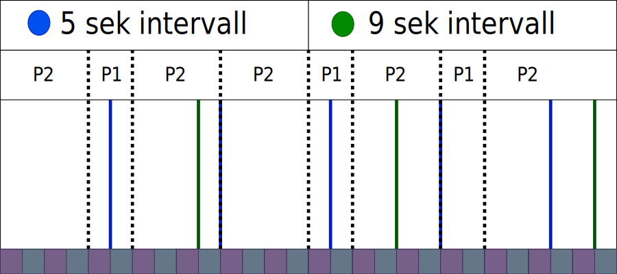
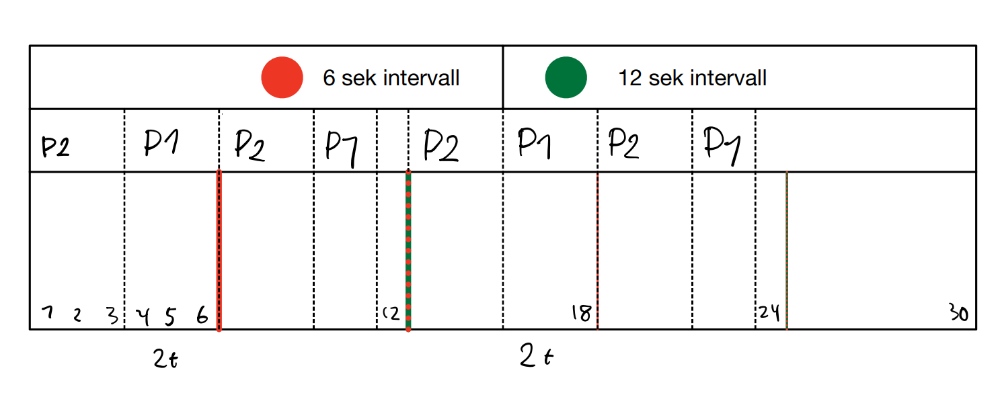

# Eksamen 2023 Vår

## Oppgave 1 – Flervalgspørsmål

### 1.1

Hvilke av de følgende tillater I/O moduler og hovedminnet å utveksle data direkte?

- [ ] (a) Memory management unit (MMU)
- [x] (b) Direct memory access (DMA)
- [ ] (c) Memory address register
- [ ] (d) Alle de ovanfor
- [ ] (e) Ingen av de ovenfor

	> b) DMA

### 1.2

Hvilke av de følgende kan forklare hvorfor mer hovedminne (RAM) kan øke datamaskinen sin ytelse?

- [ ] (a) Mer RAM kan redusere den eksterne fragmenteringen
- [ ] (b) Mer RAM kan øke prosessorhastigheten
- [x] (c) Mer RAM kan redusere sannsynligheten for sidefeil
- [ ] (d) Alle de ovenfor
- [ ] (e) Ingen av de ovenfor

	> c) Mer RAM kan redusere sannsynligheten for sidefeil

### 1.3

Hvilken av de følgende vil bli lagret under et kontekstbytte mellom prosesser

- [ ] (a) Stack pointer
- [ ] (b) Program counter
- [ ] (c) CPU registers
- [x] (d) Alle de ovenfor
- [ ] (e) Ingen av de ovenfor

	> d) Alle de ovenfor

### 1.4

Hvilke av de følgende datastrukturene er generelt brukt av operativsystem for å lagre informasjon knyttet til en prosess?

- [x] (a) Process control block (PCB)
- [ ] (b) Process identifier
- [ ] (c) Process state
- [ ] (d) Alle de ovenfor
- [ ] (e) Ingen av de ovenfor

	> a) Process control block (PCB)

### 1.5

En adresse generert av CPUen er vanlegvis omtalt som en ...

- [ ] (a) Physical address
- [ ] (b) Absolute address
- [x] (c) Logical address
- [ ] (d) Alle de ovenfor
- [ ] (e) Ingen av de ovenfor

	> c) Logical address

### 1.6

Hvilke av de følgende er en fordel med virtuelt minne?

- [ ] (a) Det tillater utførelse av prosesser som ikke er fullstendig i minnet
- [ ] (b) Det abstraherer hovedminnet til et ekstremt stort logisk minne
- [ ] (c) Det tillater å kjøre program som er større enn fysisk minne
- [x] (d) Alle de ovenfor
- [ ] (e) Ingen av de ovenfor

	> d) Alle de ovenfor

### 1.7

Hvilken trådmodell tillater alle tråder å kjøre på same tid, og samtidig alle CPU-kjerner å bli utnyttet på same tid?

- [x] (a) En-til-en
- [ ] (b) En-til-mange
- [ ] (c) Mange-til-en
- [ ] (d) Mange-til-mange
- [ ] (e) Ingen av de ovenfor

	> a) En-til-en

### 1.8

Hva er en kjernetråd?

- [x] (a) En virtuell CPU som bruker-tråder er tilordnet
- [ ] (b) Det som tråder blir kalt når brukt av kernelen
- [ ] (c) Gamelt navn for tråder
- [ ] (d) Bare bruke for en-til-en tråd-modell

	> a) En virtuell CPU som bruker-tråder er tilordnet

### 1.9

Hvorfor spiller det noen rolle at mobiltelefonen din er en Von Neumann-maskin?

- [ ] (a) Det spiller ingen rolle i det hele tatt
- [x] (b) Det gjør det mulig å installere program fra app-butikker
- [ ] (c) Det betyr at den kan utføre alle operasjoner (Von Neumann-komplett)
- [ ] (d) Mobiltelefoner er generelt sett ikke Von Neumann-maskiner

	> b) Det gjør det mulig å installere program fra app-butikker

### 1.10

Hva er eksternt minne?

- [ ] (a) Lagring som er utenfor datamaskin-kabinettet
- [ ] (b) Lagring som er utenfor CPU
- [x] (c) Lagring som som ikke kan adresseres direkte fra CPU
- [ ] (d) “Hot-pluggable” lagring (kan bli koblet til en kjørendee datamaskin)

	> c) Lagring som som ikke kan adresseres direkte fra CPU

### 1.11

Hva av de følgende er er riktig om en databuss?

- [x] (a) Den har mulighet til å forbinde mer enn to enheter i et datasystem
- [ ] (b) Det kan ikke vere seriell (må ha flere parallelle datalinjer)
- [ ] (c) Den må ha stor båndbredde
- [ ] (d) Den er bare brukt til å kople CPU til hovedminne
- [ ] (e) Alle de ovenfor

	> a) Den har mulighet til å forbinde mer enn to enheter i et datasystem

### 1.12

Hva av det følgende er riktig om CPU?

- [ ] (a) En CPU-brikke kan bare ha en kjerne
- [ ] (b) En datamaskin kan bere ha en CPU-brikke
- [ ] (c) Om en datamaskin har mer enn en kjerne, så kan det bare være en CPU-brikke i datamaskinen
- [x] (d) En datamaskin kan ha flere CPU-brikker med flere kjerner hver

	> d) En datamaskin kan ha flere CPU-brikker med flere kjerner hver

## Oppgave 2 – Diverse

### 2.1

Ta utgangspunkt i et datasystem som bruker 16-bit logisk adresse. Hva er størrelsen på det logiske adresserommet?

> 2^16 = 65536 = 64Kb

### 2.2

Ta utgangspunkt i et datasystem som støtter “paging” maskinvare med en “translation look-aside buffer” (TLB).
Anta en prosess som har noen av sine forespurte sider i fysisk minne.
Sidetabellen for prosessen trenger å bli oppdatert når det det er en sidefeil.
Anta videre at prosessen forsøker å få tilgang til en side.

- **a)**
  Ta utgangspunkt i et datasystem som støtter “paging” maskinvare med en “translation look-aside buffer” (TLB).
  Anta en prosess som har noen av sine forespurte sider i fysisk minne.
  Sidetabellen for prosessen trenger å bli oppdatert når det det er en sidefeil.
  Anta videre at prosessen forsøker å få tilgang til en side.

	> en (for å hente siden)

- **b)**
  Hvor mange minnetilganger er nødvendig for å hente siden om sidenummeret ikke er funne i TLB og det det ikke er en sidefeil?

	> To (en for å sjekke page nummer i page table, og en for å hente fra minnet)

- **c)**
  Hvor mange tilganger til “backing store” er nødvendig om det er en sidefeil og offersiden er skitten?

	> To (one for paging out the dirty page, and one for paging in the requested page)

- **d)**
  Når en prosess bruker mer tid på “paging” enn utføring, så sier vi at prosessen ...

	> Thrashing

### 2.3

Forklar forskjellene og likhetene mellom prosesser og tråder.

> En tråd deler resurser med forelder prosessen, mens prosesser er seperate.
> En child tråd kan lese og skrive til samme minnet som forelder prosessen, men en child prosess kan ikke gjøre dette.

### 2.4

Du har nettopp startet en ny prosess ved å bruke fork systemkallet. Hvordan kan du vite om du nå kjører i forelder eller barne-prosessen?

> fork systemkallet returnerer 0 for child prosesser, mens PID til den nye child prosessen for forelder prosessen.

### 2.5

Hva betyr det at en tråd-modell er en-til-en? Hvilke andre modeller er mulige? Forklar.

> en-til-en:
> en-til-mange:
> mange-til-en:
> mange-til-mange:

## Oppgave 3 – Cache

### 3.1

Ta utgangspunkt i at B0, B2, B4, B6 and B8 er tilordnet til C0, og B1, B3, B5, B7 og at B9 er tilordnet til C1 hvor Bi refererer til i. blokk i hovedminnet og Cj refererer til j. cache-linje.
Anta at B1 og B4 er i cache.
Hva er antall “cache misses” om B8, B4, B1, B8, B1 har tilgang i den viste rekkefølgen?
Rettferdiggjør svaret ditt ved å vise hvilke tilganger som førte til “cache miss”.

 > tmp

### 3.2

Forklar kva som er mening med cache minne.
Hva ville virkningene vært om en CPU ikke har cache minne i det hele tatt?

 > tmp

### 3.3

Du vil kjøpe en ny datamaskin.
Du vurderer en modell med flere muligheter for mengde hovedminne og cache minne (men ellers samme spesifikkasjoner).
Hva er virkningene av å øke størrelsen av cache minne sammmenlignet med å øke størrelsen på hovedminne?

 > tmp

### 3.4

Du utvikler noe programvare.
En kollega ser på koden din, og seier at det vil bli mange sidefeil slik du har skrevet koden.
Hva kan årsakene til dette være?

 > tmp

### 3.5

Typisk har en moderne CPU flere lag med cache minne.
Forklar grunnen til dette - hvorfor ikke bare et enkelt lag?

 > tmp

## Oppgave 4 – Assembler og adressemodi

### 4.1

Ta utgangspunkt i fragmentet med assembler-kode i Listing 1.

```assembly
push dword 1
push dword 2
push dword 3
push dword 4
pop eax - 4
mov ebx ,[esp+4] - 2
pop ecx - 3
add eax , ebx - 4 + 2 = 6
```

Anta at alle instruksjonene i Listing 1 er utført, og at “stack” vokser mot lavere adresser.

- **a)** Hva er verdien lagret i register ecx?

	> 3

- **b)** Hva er verdien lagret i register ebx?

	> 2

- **c)** Hva er verdien lagret i register eax?

	> 6

- **d)** Hva er verdien ved adressen lagret i esp?

	> 2

- **e)** Hva er verdien ved adressen lagret i esp+4?

	> 1

### 4.2

Identifiser hvilken adressemodus som blir brukt for hver av operandene i de følgende instruksjonene:

- **a)** `sub eax, 5`

	> **eax**: register
	> **5**: immediate

- **b)** `mov ebx, [eax]`

	> **ebx**: register
	> **\[eax]**: register indirect

- **c)** `mov [esp + 4], NUM`

	> **\[esp+4]**: register indirect
	> **NUM**: direct

> **Forklaring:**
>
> **Register** (Direkte eller Registerdirekte):
>> I denne modusen er operanden et register. For eksempel, i instruksjonen sub eax, 5, er eax en direkte operand.
>
> **Immediate** (Umiddelbar):
>> I denne modusen er operanden en konstant. For eksempel, i instruksjonen sub eax, 5, er 5 en umiddelbar operand.
>
> **Register Indirect** (Indirekte eller Registerindirekte):
>> I denne modusen er operanden en adresse som er lagret i et register. For eksempel, i instruksjonen mov ebx, [eax], er [eax] en indirekte operand.
>
> **Direct** (Direkte):
>> I denne modusen er operanden en direkte adresse. Dette er litt forvirrende fordi "direkte" også kan referere til registerdirekte modus. I denne konteksten betyr det at operanden "NUM" refererer direkte til en minnelokasjon, ikke en verdi lagret i et register eller en konstant

## Oppgave 5 – Prosess synkronisering

### 5.1

Typisk kan bare en prosess skrive til en kritisk seksjon på samme tid, mens det er mulig for flere prosesser å lese fra en kritisk seksjon på samme tid.
Men hva er situasjonen om en prosess ønsker å lese mens en annen ønsker å skrive til den samme kritiske seksjonen på samme tid?
Forklar.

 > Dette vil ikke fungere. Hvis det ikke er noen som skriver til en kritisk seksjon, så går det fint om flere tråder / prosesser leser fra den samtidig, da dataen ikke vil endres ved lesing.
 > Derimot vil det oppstå problemer om en prøver å lese fra en kritisk seksjon samtidig som den blir skrevet til. Da vet du ikke om dataen du leser er den gamle dataen fra *før* skrivingen skjer, eller om det er ny data fra *etter* skrivingen skjer, og man får en race condition.

### 5.2

Tre populære metoder for å beskytte en kritisk seksjon er låsar, semaforar og monitorar.
Forklar forskjeller og likheter mellom disse metodene.

> **Låser:**
> En lås er en enkel metode for å unngå race conditions.
> En tråd vil låse låsen, og andre tråder vil se at låsen er låst, og må vente til låsen er åpen igjen før de kan fortsette.
> Tråden som låste låsen må åpne låsen når den er ferdig.
>
> **Semaforer:**
> En semafor er ganske lik som en lås.
> Hovedforskjellen er at den har en teller som forteller hvor mange tråder som kan få tilgang samtidig.
> Når en tråd ønsker å tilgang så reduserer den telleren med 1.
> Hvis telleren er 0 så betyr det at det ikke er flere åpne plasser til denne resursen og tråden må vente.
> Når den er ferdig med resursen så må den øke telleren med 1 igjen.
>
> **Monitorer**
> En monitor har ganske lik funksjonalitet som en semafor, bortsett fra at signaler ikke "lagres" slik som semaforer og telleren den har.
> Hvis det ikke er noen tråder som venter i en wait() på et signal, så blir signalet forkastet, "glemt" av monitoren.
> Dette betyr at hvis det så kommer en ny tråd med wait() så må den vente på at det kommer et nytt signal før den kan fortsette.

### 5.3

En kollega utvikler noe programvare med to prosesser som utveksler data.
Denne personen har ikke brukt noen mekanisme for prosesssynkronisering, men sier at han/hun ikke har hatt noen problem med programvaren på tross av dette.
Forklar for denne personen hvorfor dette ikke er noen god ide, og mulige grunner for at han/hun ikke har merket noe problem.

> Det at de ikke har opplevd noe problem enda, er ikke en god nok grunn til å unngå mekanismer for prosessynkronisering.
> Når en ikke har dette så vil race conditions dukke opp, det er bare snakk om tid. Denne personen har bare vært heldig så langt.
> Det neste er at det kan godt hende de ikke har lagt merke til problemene enda. I noen programmer vil ikke alltid race conditions gjøre at programmet kræsjer, eller at det ikke funker, men kanskje den gjør mer arbeid etc. pga. verdier som leses før / etter den blir skrevet i en rekkefølge som kan skape slike problemer.
> I utgangspunktet kan en tenke at det ikke har noe å si, den ene tråden vil alltid lese før den andre pga. den andre tråden kjører med tidkrevende kode etc, men en må og huske at eksterne faktorer utenfor programmet kan også ha en innvirkning.
> Plutselig kan den raske tråden bli plassert på en treig CPU kjerne, og den treige tråden på en rask kjerne, og rekkefølgen blir annerledes.

### 5.4

Noe programvare trenger å beskytte en delt variabel.
Bare en prosess kan skrive til variabelen til samme tid, mens fleire prosessar kan lese fra den til samme tid (selvsagt bare om en annen prosess ikke skriver til den).
Skriv pseudo-kode for dette.
Du kan anta at grunnleggende funksjoner det er behov for er tilgjengeleg fra systembibliotek.

```java
int teller = 0 // teller antall lesere
boolean writelock = false // lås for skriver

Tråd leser() {
	while(writelock) { // sjekk om det er noen som skriver
		wait()
	}
	teller++
	// les fra delt variabel
	teller--
}

Tråd skriver() {
	while(teller > 0 || writelock) { // sjekk om det er noen som leser eller om skrivelås er på
		wait()
	}
	writelock = true
	// skriv til delt varabel
	writelock = false
}
```

## Oppgave 6 – CPU tidsplanlegging

### 6.1

Ta utgangspunkt i følgede tabell for prosesseringtid og periode for to periodiske prosesser P~1~ og P~2~:

| Prosess | Prosesseringtid | Periode |
| :---: | :---: | :---: |
| P~1~ | 2 | 9 |
| P~2~ | 4 | 5 |

Tidsfristen for hver av prosessene er starten på sin neste periode.
For eksempel, fristen for fullførelse for P~1~ er ved tid 9, 18, 27, ..., mens frist for fullførelse av P~2~ er ved tid 5, 10, 15, ... .
Bruk "*Første frist først*" for å tidsplanlegge de to prosessene.
Ved ***`tid = 20`***, kan de to prosessane møte alle deres frister?
Tegn Gantt-diagram av utførelsen for å rettferdiggjøre svaret.

> Ja, de klarer å møte sine deadlines som faller innenfor `tid = 20`
> 

### 6.2

Ta utgangspunkt i følgende tabell for prosesseringtid og periode for to periodiske prosesser P~1~ og P~2~:

| Prosess | Prosesseringtid | Periode |
| :---: | :---: | :---: |
| P~1~ | 5 | 12 |
| P~2~ | 3 | 6 |

Fristen for hver av prosessene er starten på sin neste periode.
For eksempel, fristen for fullførelse for P~1~ er ved tid 12, 24, 36, ..., mens fristen for fullførelse av P~2~ er ved tid 6, 12, 24, ... .
Bruk “*Rate-Monotonic Scheduling*” for å tidsplanlegge de to prosessene, hvor prioriteten er tilordnet basert på perioden for hver prosess: *dess kortere periode, dess høyere prioritet*.
Ved ***`tid = 24`***, kan de to prosessene møte alle deres frister?
Tegn Gantt-diagram av utførelsen for å rettferdiggjøre svaret.

> Ja, de klarer å møte alle deadlines som faller innenfor `tid = 24`
> 

## Oppgave 7 – Sideinndeling

### 7.1

Anta at hver sidestørrelse er 2 KB (1 KB = 1024 B). Ta utgangspunkt i følgende tabell:

| Sidenummer | Rammenummer | Ramme sin startadresse |
| :---: | :---: | :---: |
| ***`i`*** | ***`j`*** | ***`k`*** |
| 5 | 4 | 8192 |
| 6 | 12 | 24576 |
| 7 | 6 | 12288 |
| 8 | 5 | 10249 |

Hver av linjene representerer en tilordning fra side ***`i`*** til ramme ***`j`***, hvor ramme ***`j`*** starter fra adresse ***`k`*** i det fysiske minnet.
For eksempel, den første linjen refererer til side 5 er tilordnet til ramme 4 som starter fra adresse 8192 i det fysiske minnet.

- **(a)**
	Skriv ned i desimaltall, sidenummeret, “offset” og den fysiske adressen for den logiske adressen 14378.

	> heltalls divisjon for å finne sidenummer

	```math
	sidenummer = 14378 / 2048 = 7
	```

	> modulo divisjon for å få rest, som er offset

	```math
	offset = 14378 % 2048 = 42
	```

	> ramme start adresse + offset blir fysisk adresse

	```math
	fysisk adresse = 12288 + 42 = 12330
	```

- **(b)**
	Skriv ned i desimaltall, den logiske adressen for den fysiske adressen 9216.

	> adressen er en del av side 5, fysisk adresse er innenfor side 5 sitt minneområde

	```math
	8192 + 2048 > 9216
	```

	> offset er fysisk adresse - ramme start

	```math
	offset = 9216 - 8192 = 1024
	```

	> 2048 * sidenummer for å finne logisk adresse start
	> deretter legg til offset for å finne logiske adressen

	```math
	logisk adresse = (2048 * 5) + 1024 = 11264
	```

### 7.2

Nå, anta at sidestørrelsen er 4 KB.

- **(a)**
	Om en prosess forespør 20598 byter fra operativsystemet, hvor mange sider vil prosessen bli allokert?
	Er det noen intern fragmentering?

	```math
	20598 / 4096 = 5.028
	```

	> Blir mer enn 5 sider, m å allokere 6 sider, noe som fører til at det blir intern fragmentering

	```math
	4096 - (4096*0.028) ~= 3982
	```

	> Det blir da 3982 bytes med intern fragmentering

- **(b)**
	Ta utgangspukt i et datasystem som bruker 16-bit logiske adresser.
	Hvor mange linjer er det i en sidetabell?
	Hva er størrelsen for sidetabellen?

	> bruker 16-bit logiske adresser
	> dvs at det er 2^16^ mulige adresser

	```math
	linjer = 2^{16} / 4096 = 2^{16} / 2^{12} = 2^{16-12} = 2^4 = 16
	```

	> blir 16 linjer i sidetabellen
	>
	> 16 bit = 2 bytes

	```math
	størrelse = 2 * 16 = 32
	```

	> Størrelsen på sidetabellen blir 32 bytes

## Vedlegg

### Vedlegg – ASCII-tabell (fra [asciitable.com](www.asciitable.com))


### Vedlegg - Assembly Code Table


### Vedlegg - Linux/unix systemkall

| %eax | Name | %ebx | %ecx | %edx | %esx | %edi |
| :---: | :---: | :---: | :---: | :---: | :---: | :---: |
| 1 | sys_exit | int | - | - | - | - |
| 2 | sys_fork | struct | pt_regs | - | - | - | - |
| 3 | sys_read | unsigned int | char * | size_t | - | - |
| 4 | sys_write | unsigned int | const char * | size_t | - | - |
| 5 | sys_open | const char * | int | int | - | - |
| 6 | sys_close | unsigned int | - | - | - | - |
